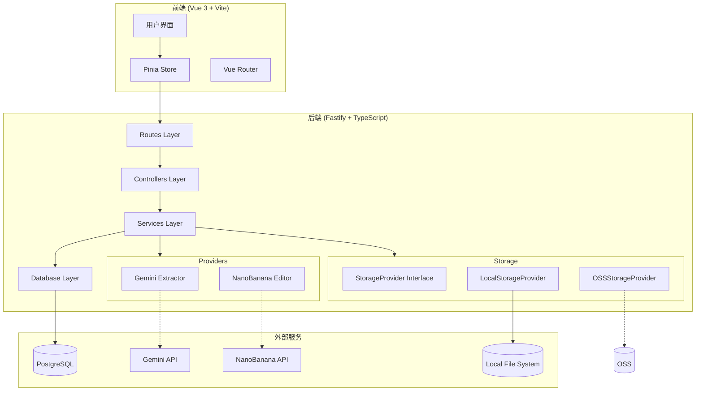
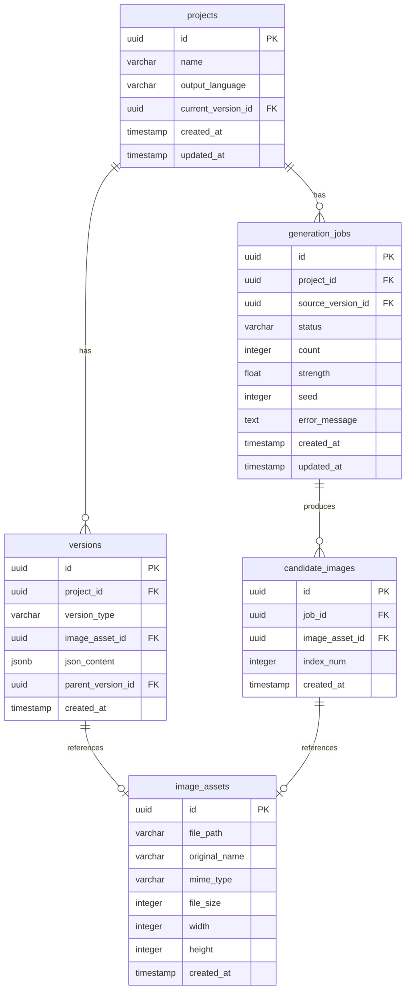

# Design Document: Image Editor JSON-Driven

## Overview

本系统是一个基于 JSON 驱动的在线图片编辑器，采用前后端分离架构。用户上传图片后，系统通过 AI 模型提取结构化 JSON 描述，用户可编辑 JSON 后调用图片生成模型产生候选图，并支持完整的版本历史管理。

技术栈：
- 前端：Vue 3 + Vite + TypeScript + Pinia + Vue Router
- 后端：Node.js + TypeScript + Fastify
- 数据库：PostgreSQL（node-postgres）
- 存储：本地文件系统（可扩展 OSS）

## Architecture



## Components and Interfaces

### 后端分层架构

```
server/
├── src/
│   ├── routes/           # 路由定义
│   │   ├── projects.ts
│   │   └── generations.ts
│   ├── controllers/      # 请求处理
│   │   ├── projectController.ts
│   │   └── generationController.ts
│   ├── services/         # 业务逻辑
│   │   ├── projectService.ts
│   │   ├── versionService.ts
│   │   └── generationService.ts
│   ├── providers/        # AI 模型适配器
│   │   ├── types.ts
│   │   ├── gemini/
│   │   │   ├── interface.ts
│   │   │   ├── mock.ts
│   │   │   └── real.ts
│   │   └── nanoBanana/
│   │       ├── interface.ts
│   │       ├── mock.ts
│   │       └── real.ts
│   ├── storage/          # 存储服务
│   │   ├── interface.ts
│   │   ├── local.ts
│   │   └── oss.ts
│   ├── db/               # 数据库访问
│   │   ├── index.ts
│   │   ├── migrations.ts
│   │   └── queries/
│   ├── utils/            # 工具函数
│   │   ├── validator.ts
│   │   └── errors.ts
│   └── index.ts          # 入口
├── migrations/           # SQL 迁移文件
└── package.json
```

### 核心接口定义

#### StorageProvider 接口

```typescript
interface StorageResult {
  path: string;      // 存储路径
  url: string;       // 访问 URL
  size: number;      // 文件大小
}

interface StorageProvider {
  save(buffer: Buffer, ext: string, mime: string): Promise<StorageResult>;
  read(path: string): Promise<Buffer>;
  getUrl(path: string): string;
  delete(path: string): Promise<void>;
}
```

#### GeminiExtractor 接口

```typescript
interface ExtractResult {
  json: CanonicalJSON;
  rawResponse?: any;
}

interface GeminiExtractor {
  extract(imageBuffer: Buffer, outputLanguage: string): Promise<ExtractResult>;
}
```

#### NanoBananaEditor 接口

```typescript
interface GenerateOptions {
  count: number;        // 1-8
  seed?: number;
  strength?: number;    // 0-1
}

interface GeneratedImage {
  buffer: Buffer;
  index: number;
}

interface NanoBananaEditor {
  generate(
    baseImage: Buffer,
    jsonContent: CanonicalJSON,
    options: GenerateOptions
  ): Promise<GeneratedImage[]>;
}
```

### 前端组件结构

```
client/
├── src/
│   ├── components/
│   │   ├── common/
│   │   │   ├── AppHeader.vue
│   │   │   └── LoadingSpinner.vue
│   │   ├── project/
│   │   │   ├── VersionList.vue
│   │   │   ├── ImagePreview.vue
│   │   │   ├── JsonEditor.vue
│   │   │   ├── GeneratePanel.vue
│   │   │   └── CandidateGrid.vue
│   │   └── home/
│   │       └── ProjectList.vue
│   ├── views/
│   │   ├── HomeView.vue
│   │   └── ProjectView.vue
│   ├── stores/
│   │   ├── project.ts
│   │   └── generation.ts
│   ├── api/
│   │   └── index.ts
│   ├── types/
│   │   └── index.ts
│   ├── router/
│   │   └── index.ts
│   └── main.ts
└── package.json
```

## Data Models

### 数据库 Schema



### TypeScript 类型定义

```typescript
// 版本类型枚举
type VersionType = 'imported' | 'json_edit' | 'selected_candidate' | 'checkout';

// 任务状态枚举
type JobStatus = 'queued' | 'running' | 'succeeded' | 'failed';

// 项目实体
interface Project {
  id: string;
  name: string;
  outputLanguage: string;
  currentVersionId: string | null;
  createdAt: Date;
  updatedAt: Date;
}

// 版本实体
interface Version {
  id: string;
  projectId: string;
  versionType: VersionType;
  imageAssetId: string | null;
  jsonContent: CanonicalJSON | null;
  parentVersionId: string | null;
  createdAt: Date;
}

// 图片资源实体
interface ImageAsset {
  id: string;
  filePath: string;
  originalName: string;
  mimeType: string;
  fileSize: number;
  width: number;
  height: number;
  createdAt: Date;
}

// 生成任务实体
interface GenerationJob {
  id: string;
  projectId: string;
  sourceVersionId: string;
  status: JobStatus;
  count: number;
  strength: number | null;
  seed: number | null;
  errorMessage: string | null;
  createdAt: Date;
  updatedAt: Date;
}

// 候选图实体
interface CandidateImage {
  id: string;
  jobId: string;
  imageAssetId: string;
  indexNum: number;
  createdAt: Date;
}
```

### Canonical JSON Schema

```typescript
interface CanonicalJSON {
  meta: {
    schema_version: string;
    output_language: string;
    width: number;
    height: number;
  };
  scene: {
    summary: string;
    style: {
      genre: string;
      palette: string;
      rendering: string;
    };
    camera: {
      shot: string;
      lens: string;
      angle: string;
      dof: string;
    };
    lighting: {
      type: string;
      direction: string;
      contrast: string;
    };
  };
  elements: Array<{
    id: string;
    type: 'subject' | 'object' | 'text' | 'background' | 'effect';
    name: string;
    description: string;
    geometry: {
      bbox: [number, number, number, number];
      polygon: number[][];
      depth_hint: number;
    };
    appearance: {
      material: string;
      color: string;
      texture: string;
      text?: {
        content: string;
        font_hint: string;
        language: string;
      };
    };
    constraints: {
      keep_identity: boolean;
      preserve_text_legibility: boolean;
    };
  }>;
  relations: Array<{
    from: string;
    to: string;
    type: 'occludes' | 'attached_to' | 'in_front_of' | 'part_of';
  }>;
  edit_intent: {
    goal: string;
    negatives: string[];
    safety: {
      avoid: string[];
    };
  };
}
```

## Correctness Properties

*A property is a characteristic or behavior that should hold true across all valid executions of a system-essentially, a formal statement about what the system should do. Properties serve as the bridge between human-readable specifications and machine-verifiable correctness guarantees.*

### Property 1: 图片上传创建完整项目结构

*For any* 有效图片文件（png/jpg/webp，大小 ≤ 10MB），上传后系统应创建 Project、Version（type="imported"）和 ImageAsset，且 Version 应包含 GeminiExtractor 返回的 JSON。

**Validates: Requirements 1.1, 1.2, 1.3**

### Property 2: 文件名 UUID 安全性

*For any* 上传或生成的图片文件，存储路径中的文件名应为有效的 UUID v4 格式，不包含原始文件名。

**Validates: Requirements 1.2, 7.4**

### Property 3: 项目默认语言设置

*For any* 新创建的 Project，output_language 字段应默认为 "zh-CN"。

**Validates: Requirements 2.1**

### Property 4: JSON Schema 合规性

*For any* GeminiExtractor 返回的 JSON 或用户编辑保存的 JSON，必须符合 CanonicalJSON schema，且 key 为英文。

**Validates: Requirements 2.3, 2.5**

### Property 5: JSON 编辑版本继承

*For any* JSON 编辑操作，创建的新 Version（type="json_edit"）应继承当前版本的 image_asset_id，且 json_content 为新编辑的内容。

**Validates: Requirements 3.3, 3.4**

### Property 6: 生成任务状态机

*For any* GenerationJob，状态转换应遵循：queued → running → (succeeded | failed)，不允许逆向转换。

**Validates: Requirements 4.1, 4.4, 4.5, 4.6**

### Property 7: 候选图数量一致性

*For any* 成功的 GenerationJob，生成的候选图数量应等于请求的 count 参数（1-8）。

**Validates: Requirements 4.2, 4.5**

### Property 8: 候选图选择版本创建

*For any* 候选图选择操作，创建的新 Version（type="selected_candidate"）应引用选中的候选图 ImageAsset，并保存当时的 JSON 快照。

**Validates: Requirements 4.7, 4.8**

### Property 9: Checkout 版本复制

*For any* checkout 操作，创建的新 Version（type="checkout"）应完整复制源版本的 image_asset_id 和 json_content。

**Validates: Requirements 5.2, 5.3**

### Property 10: 版本历史不可变性

*For any* 项目操作（编辑、生成、checkout），版本总数只能增加，不能减少或修改已有版本。

**Validates: Requirements 5.4**

### Property 11: 版本列表排序

*For any* 项目的版本列表查询，返回结果应按 created_at 降序排列。

**Validates: Requirements 5.5**

### Property 12: 任务查询响应完整性

*For any* GenerationJob 查询，响应应包含 status 字段；当 status 为 succeeded 时，应包含所有候选图的 URL。

**Validates: Requirements 6.2, 6.3**

### Property 13: Mock Provider JSON 合规性

*For any* MockGeminiExtractor 调用，返回的 JSON 应符合 CanonicalJSON schema。

**Validates: Requirements 8.3**

### Property 14: Mock Provider 候选图数量

*For any* MockNanoBananaEditor 调用，返回的候选图数量应等于请求的 count 参数。

**Validates: Requirements 8.4**

### Property 15: 迁移执行记录

*For any* 成功执行的数据库迁移，应在 schema_migrations 表中记录迁移文件名和执行时间。

**Validates: Requirements 9.4**

## Error Handling

### 错误响应格式

所有 API 错误响应使用统一格式：

```typescript
interface ErrorResponse {
  error: string;
  code?: string;
  details?: any;
}
```

### 错误类型与处理

| 错误场景 | HTTP 状态码 | 错误消息 |
|---------|------------|---------|
| 文件大小超过 10MB | 400 | FILE_TOO_LARGE |
| 文件格式不支持 | 400 | INVALID_FILE_TYPE |
| JSON 格式错误 | 400 | INVALID_JSON |
| JSON 超过 1MB | 400 | JSON_TOO_LARGE |
| count 超出范围 | 400 | INVALID_COUNT_RANGE |
| 项目不存在 | 404 | PROJECT_NOT_FOUND |
| 版本不存在 | 404 | VERSION_NOT_FOUND |
| 任务不存在 | 404 | JOB_NOT_FOUND |
| 候选图不存在 | 404 | CANDIDATE_NOT_FOUND |
| AI 模型调用失败 | 500 | PROVIDER_ERROR |
| 存储服务失败 | 500 | STORAGE_ERROR |
| 数据库错误 | 500 | DATABASE_ERROR |

### 错误处理中间件

```typescript
// Fastify 错误处理
fastify.setErrorHandler((error, request, reply) => {
  const statusCode = error.statusCode || 500;
  const response: ErrorResponse = {
    error: error.message,
    code: error.code,
  };
  
  if (process.env.NODE_ENV === 'development') {
    response.details = error.stack;
  }
  
  reply.status(statusCode).send(response);
});
```

## Testing Strategy

### 单元测试

使用 Vitest 进行单元测试，覆盖：

- **Services**: 业务逻辑测试
- **Validators**: JSON schema 验证测试
- **Utils**: 工具函数测试

### 属性测试

使用 fast-check 进行属性测试，每个属性测试运行 100 次迭代：

```typescript
import fc from 'fast-check';
import { describe, it, expect } from 'vitest';

// Property 2: 文件名 UUID 安全性
describe('Storage', () => {
  it('should generate UUID filenames for all uploads', () => {
    fc.assert(
      fc.property(
        fc.uint8Array({ minLength: 1, maxLength: 1000 }),
        fc.constantFrom('png', 'jpg', 'webp'),
        async (buffer, ext) => {
          const result = await storage.save(Buffer.from(buffer), ext, `image/${ext}`);
          const filename = path.basename(result.path, `.${ext}`);
          expect(isValidUUID(filename)).toBe(true);
        }
      ),
      { numRuns: 100 }
    );
  });
});
```

### 集成测试

使用 Supertest 进行 API 集成测试：

- 完整上传流程测试
- 版本创建流程测试
- 生成任务流程测试

### 测试配置

```typescript
// vitest.config.ts
export default defineConfig({
  test: {
    globals: true,
    environment: 'node',
    coverage: {
      provider: 'v8',
      reporter: ['text', 'json', 'html'],
    },
  },
});
```

## API Reference

### Projects API

#### POST /api/projects/upload

上传图片并创建项目。

**Request:**
- Content-Type: multipart/form-data
- Body: file (图片文件), name? (项目名称), output_language? (输出语言)

**Response:**
```json
{
  "project": {
    "id": "uuid",
    "name": "string",
    "outputLanguage": "zh-CN",
    "currentVersionId": "uuid"
  },
  "version": {
    "id": "uuid",
    "versionType": "imported",
    "imageAssetId": "uuid",
    "jsonContent": { ... }
  },
  "imageAsset": {
    "id": "uuid",
    "url": "/uploads/xxx.png"
  }
}
```

#### GET /api/projects/:id

获取项目详情。

#### PATCH /api/projects/:id

更新项目设置。

#### GET /api/projects/:id/versions

获取版本列表。

#### POST /api/projects/:id/versions

创建新版本（json_edit/checkout/selected_candidate）。

#### POST /api/projects/:id/generate

创建生成任务。

#### POST /api/projects/:id/select

选定候选图创建新版本。

### Generations API

#### GET /api/generations/:id

查询任务状态和候选图。

